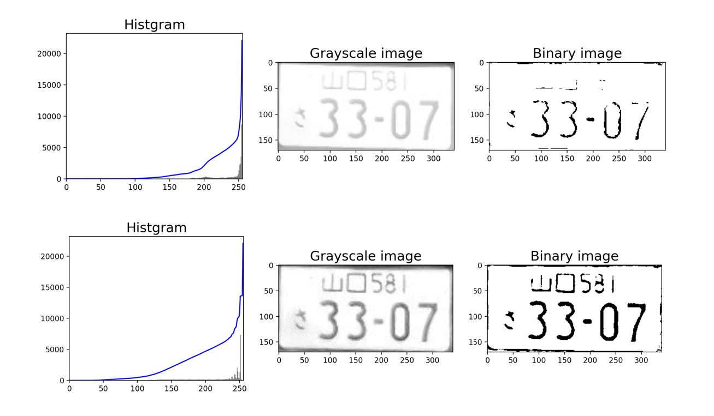

# ナンバープレートの文字認識システム

ナンバープレートの文字認識を行い、認識結果をデータベースに保存する。

### 使用技術

- tkinter (PythonのGUIライブラリ)
- Tensorflow
- EfficientNet
- MySQL

### 実行例

- 画面左上の「画像ファイルを選択」ボタンからナンバープレート画像を入力すると、画像と画像情報が表示される。
- 文字認識が終了すると画面右に認識結果が表示される。
- 画面左下にはログが表示される。
- 画面右の「来場者の分布を表示」ボタンを押すとグラフウィンドウが立ち上がり、これまで認識してきたナンバープレートの統計が確認できる。

    
    

 

# 文字認識

### 1. 精度向上のための画像処理

光によりコントラストが低下したり、影がついたりすると認識精度が落ちるので、画像処理により改善している。

- 適応的ヒストグラム平坦化によりコントラストを上げる。上が通常の画像に対する二値化で、下がコントラストを改善した画像に対する二値化。地名が消えていないことがわかる。

    

- 適応的二値化により、影に影響されずに二値化する。真ん中が通常の二値化で、右が適応的二値化。きれいに二値化されている。
    

### 2. ナンバープレート画像を要素ごとに切り取る

ヒストグラムとハフ変換を用いてナンバープレート画像を４つの要素に分割している。

一連の分割の流れ 

### 3. 地名、ひらがな、数字の認識

EfficientNetのファインチューニングによりそれぞれの認識器を作成した。時間の関係で、地名の認識可能範囲を中国地方のみに限定している。 
テスト画像35枚の認識精度は高かった。汚れや影による誤認識が多かった。

以下の画像が認識精度のグラフです。OCRは気にしないでください。

 

# GUI

- Python の tkinter ライブラリを用いて GUI を作成した。
- シンプルで見やすくした。
- 左下にログ画面を設置し、認識時間やエラーなどが確認できるようにした。

# データベース

- ナンバープレートの各要素の認識結果を格納する。
- 車の入退出を管理する目的で作成したので、撮影時間なども格納している。
- 日間、月間、年間の地域分布を確認できるようにした。